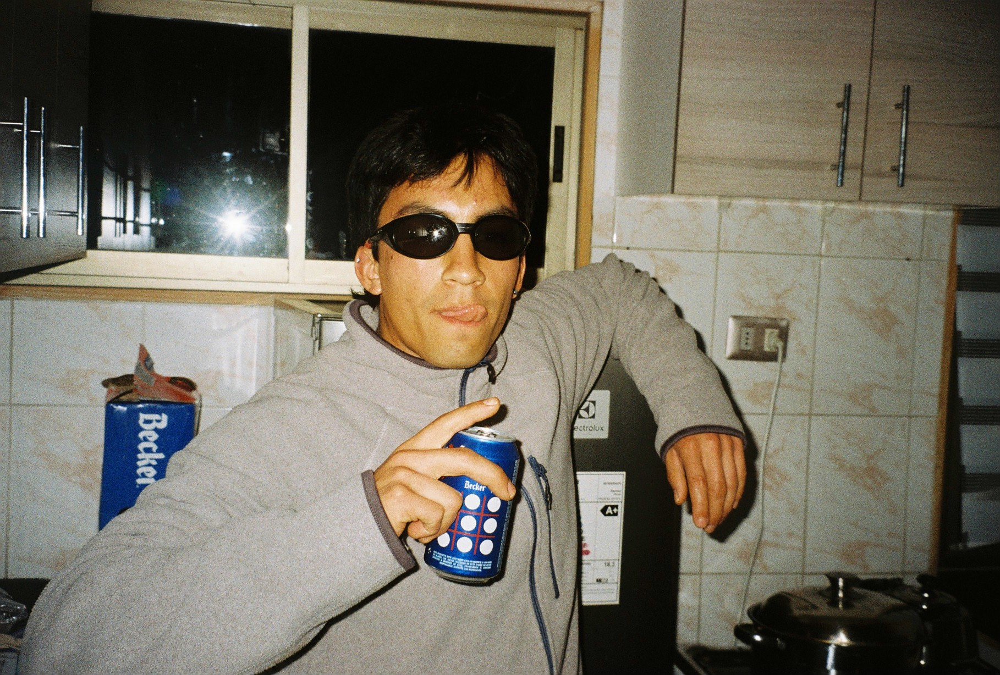
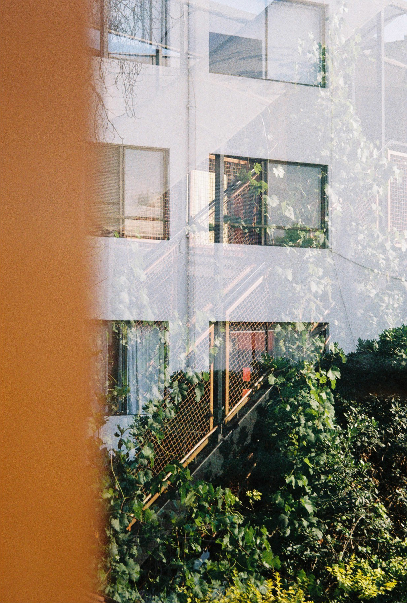
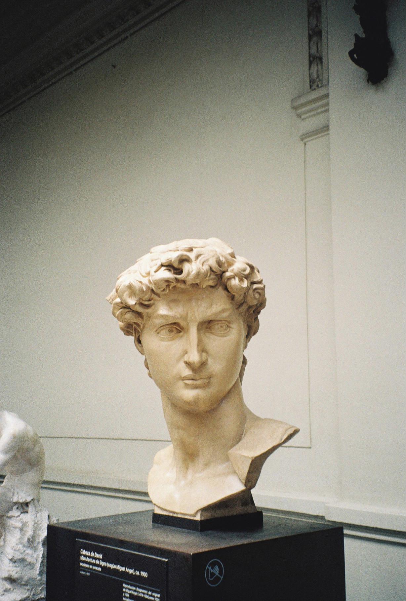
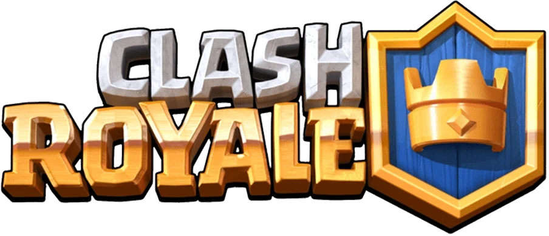

<h1>FELIPE NESTA VARGAS VALDEBENITO</h1>

  <strong>Medical Physics</strong> · Experimental Radiobiology · Dosimetry

---
---

## About me

Hi, I’m **Felipe**, a undergraduate student in **Medical Physics** with a strong interest in experimental research applied to biomedical sciences.

My academic work is mainly focused on **medical physics**, especially in the experimental area of **radiobiology** and **dosimetry**. I’m interested in understanding how physical principles can be used to study biological systems, improve experimental methodologies, and support the development of new biomedical technologies.

Beyond research, I’m motivated by the possibility of connecting science with real-world applications through **technological transfer**, innovation, and interdisciplinary collaboration.

---

## Personal profile

- **Name:** Felipe Nesta Vargas Valdebenito  
- **Academic status:** Undergraduate student in Medical Physics  
- **Relationship status:** Single 😞👊  
- **Main goal:** To grow as a researcher in medical physics, contributing to experimental science, education, and biomedical innovation.

---

## Current focus

I’m currently interested in experimental approaches related to radiation effects, biological systems, and the development of scientific tools that can contribute to biomedical innovation.

---

## Photography interests

I also enjoy photography as a way to explore light, composition, and visual storytelling.

<table>
  <tr>
    <td align="center">
      
    </td>
    <td align="center">
      
    </td>
    <td align="center">
      
    </td>
  </tr>
</table>

----

## Clash Royale

**Friend link:** 

